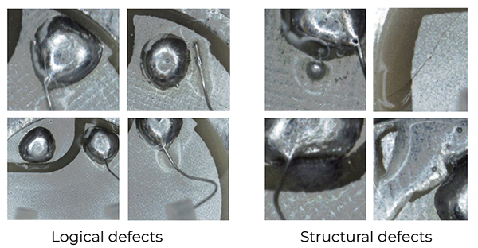

# Valeo Anomaly Dataset (VAD)
All images in VAD are captured from an actual production line, showcasing a diverse range of defects, from highly obvious to extremely subtle. This dataset bridges the gap between the academic community and the industry, offering researchers the chance to advance the performance of methods in tackling more intricate real-world challenges. Published at CVPR 2024.

## 🚀 Get started
1. Download [VAD](https://drive.google.com/file/d/1LbHHJHCdkvhzVqekAIRdWjBWaBHxPjuu/view?usp=sharing)
2. To get split for the low-shot benchmark, run `create_low_shot_train.py` in the dataset folder or use `--vad_path` to set the path to the dataset.
3. Data structure is similar to [MVTec AD](https://www.mvtec.com/company/research/datasets/mvtec-ad):

```shell
vad
|-- test
|-----|--bad
|-----|--bad_unseen_defects
|-----|--good
|-- train
|-----|--bad
|-----|--good
|-- low_shot_train.json
```

## 💡 Now available in [Anomalib](https://github.com/open-edge-platform/anomalib)
Currently only one-class (unsupervised) version.

```python
from anomalib.data import VAD
from anomalib.models import Patchcore
from anomalib.engine import Engine

# Initialize components
datamodule = VAD()
model = Patchcore()
engine = Engine()

# Train the model
engine.fit(datamodule=datamodule, model=model)
```

## 📦 Data description




VAD consists of one class with predefined training and testing sets. The training set contains 1000 bad and 2000 good images, and the testing set contains 1000 bad images, 165 of which are unseen defects, and 1000 good images. Unseen defects in the test dataset refer to several rare defect types not present in the training data. 
It contains 20+ types of defects; see Appendix C of the [paper](https://arxiv.org/abs/2405.04953) for details.

## 📄 License
VAD is released under [CC BY-NC-SA 4.0 license](https://creativecommons.org/licenses/by-nc-sa/4.0/).

## ✨ Citation
Please cite this paper if you find our dataset useful:

```
@inproceedings{baitieva2024supervised,
      title={Supervised Anomaly Detection for Complex Industrial Images}, 
      author={Aimira Baitieva and David Hurych and Victor Besnier and Olivier Bernard},
      booktitle={CVPR},
      year={2024} 
}
```
